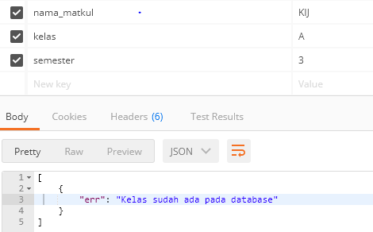
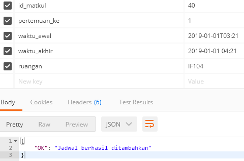

# SAFARIO
## Aplikasi Kehadiran Online

### Kelas         : PBKK G
### Nama Kelompok : Huda, Findryan, Fatimatus
### Pengajar      : Bapak Ridho Rahman

#### Berikut Teknologi yang digunakan pada Aplikasi Kehadiran Online (Safario):
* Front End       : Nunjucks
* Back End        : Node.js
* Framework       : Express js
* Database        : MySQL

#### Cara menjalankan program:
1. Lakunan Clone aplikasi
2. Install npm dengan menjalanakan  ``` npm install ```
3. Install package yang dibutuhkan dengan menjalankan syntax berikut:
 * Package express, ``` npm install express --save ```
 * Package cookie parser, ``` npm install cookie-parser ```
 * Package express session, ``` npm install express-session ```
 * Package body parser, ``` npm install body-parser ```
 * Package md5, ``` npm install md5 ```
 * Package nunjucks, ``` npm install nunjucks ```
 * Package mysql, ``` npm install mysql ```
4. Jalankan aplikasi dengan ``` node root.js ```

### Berikut List Api pada Aplikasi Kehadiran Online (Safario):
#### API Cek db:
Terdapat 5 tabel : user, daftar_peserta, matkul, transaksi_matkul, transaksi_user
akses
<br/>``` GET /tabel/(Masukan Nama Tabel) ```
<br/>
1. Absen ``` POST /absen/```
- Berikut source code API untuk absen:
```
 root.post('/absen', function(req, res) {

  if (typeof(req.body.ruang) == 'undefined' || typeof(req.body.nrp) == 'undefined') {
    return res.status(500).json([{ err: 'Format data masukan salah' }]);
  }

  var ruangan = req.body.ruang;
  var nrp_nip = req.body.nrp;
  var status = "2";
  var date = new Date();

  db.query('SELECT u.nrp_nip, tm.ruangan,tm.id_tran_matkul, u.id_user FROM daftar_peserta d, matkul m, transaksi_matkul tm, user u WHERE m.id_matkul = d.id_matkul AND u.id_user=d.id_user AND tm.id_matkul = m.id_matkul AND u.nrp_nip=? AND tm.ruangan=?',
   [nrp_nip,ruangan], function (err, results, fields) {
    if (err){
      console.log(err);
      return res.status(500).json([{ err: 'Internal Server Error' }]);
    }
    if (results.length < 1 ){
      return res.status(500).json([{ err: 'Peserta tidak terdaftar dalam kelas' }]);
    }else{
      console.log(results);
      var matkul = results[0].id_tran_matkul;
      var id_user = results[0].id_user;

      db.query('SELECT * FROM transaksi_user WHERE id_tran_matkul=? AND id_user=?',
       [matkul,id_user], function (err, results, fields) {
        if (err){
          console.log(err);
          return res.status(500).json([{ err: 'Gagal melakukan absensi, coba lagi' }]);
        }else{
          if (results.length > 0 ){
            res.setHeader('Content-Type', 'application/json');
            res.status(500).json([{ err: 'Peserta sudah melakukan absen' }]);
            res.end();
          }
        }
      });

      db.query('INSERT INTO transaksi_user (id_user,id_tran_matkul,waktu,status) values (?,?,?,?)',
       [id_user,matkul,date,status], function (err, results, fields) {
        if (err){
          console.log(err);
          res.status(500).json([{ err: 'Gagal melakukan absensi, coba lagi' }]);
        }else{
          res.status(200).json({ OK: 'Berhasil melakukan absensi' });
        }
      });
    }
  });
});
```
- Contoh:
<br/>sent via body: ruang, nrp
- Hasilnya:
<br/>

2. Rekap Kuliah per Semester
  ``` GET /rekappersemester/IDMATAKULIAH ```
  - Berikut source code untuk rekap kuliah per semester
  ```
  root.get('/rekappersemester/:id_matkul?/:id_semester?', function (req, res) {

  if (typeof(req.params.id_matkul) == 'undefined' || typeof(req.params.id_semester) == 'undefined') {
    return res.status(500).json([{ err: 'Format data masukan salah' }]);
  }

  var id_matkul = req.params.id_matkul;

  db.query('SELECT  tm.id_matkul, us.nrp_nip, us.nama_user, mat.semester, tm.pertemuan_ke, mat.nama_matkul, mat.kelas, tm.waktu_awal, tm.waktu_akhir, tm.ruangan, tu.status FROM matkul AS mat JOIN user AS us, transaksi_matkul AS tm, transaksi_user AS tu WHERE tu.id_user = us.id_user AND tu.id_tran_matkul = tm.id_tran_matkul AND tm.id_matkul=mat.id_matkul AND us.role = 2 AND mat.id_matkul = ? AND mat.semester=? ORDER BY tm.pertemuan_ke',
   [id_matkul,id_semester], function (err, results, fields) {
    if (err){
      console.log(err);
      return res.status(500).json([{ err: 'Internal Server Error' }]);
    }else{
      return res.status(200).json(results);
    }
  });
});
  ```
 - Contoh:
<br/>ex: /rekappersemester/3
- Hasilnya:
<br/>

3. Rekap Kuliah per Pertemuan
  ``` GET /rekappertemuan/IDMATAKULIAH/PERTEMUANKE ```
  ```
  root.get('/rekappertemuan/:id_matkul?/:pertemuanke?', function (req, res) {

  if (typeof(req.params.id_matkul) == 'undefined' || typeof(req.params.pertemuanke) == 'undefined') {
    return res.status(500).json([{ err: 'Format data masukan salah' }]);
  }

  var id_matkul = req.params.id_matkul;
  var pertemuanke = req.params.pertemuanke;

  db.query('SELECT  tm.id_matkul, us.nrp_nip, us.nama_user, mat.semester, tm.pertemuan_ke, mat.nama_matkul, mat.kelas, tm.waktu_awal, tm.waktu_akhir, tm.ruangan, tu.status FROM matkul AS mat JOIN user AS us, transaksi_matkul AS tm, transaksi_user AS tu WHERE tu.id_user = us.id_user AND tu.id_tran_matkul = tm.id_tran_matkul AND tm.id_matkul=mat.id_matkul AND us.role = 2 AND mat.id_matkul =? AND tm.pertemuan_ke =? ORDER BY tm.pertemuan_ke',
   [id_matkul,pertemuanke], function (err, results, fields) {
    if (err){
      console.log(err);
      return res.status(500).json([{ err: 'Internal Server Error' }]);
    }else{
      return res.status(200).json(results);
    }
  });
});
  ```
 - Contoh:
<br/>ex: /rekappertemuan/4/2
- Hasilnya:
<br/>

4. Rekap Mahasiswa per Kuliah
  ``` GET /rekapmahasiswa/NRP/IDMATAKULIAH ```
  ```
  root.get('/rekapmahasiswa/:nrp?/:id_matkul?', function (req, res) {

  if (typeof(req.params.nrp) == 'undefined' || typeof(req.params.id_matkul) == 'undefined') {
    return res.status(500).json([{ err: 'Format data masukan salah' }]);
  }

  var nrp = req.params.nrp;
  var id_matkul = req.params.id_matkul;

  db.query('SELECT tm.id_matkul, us.nrp_nip, us.nama_user, mat.semester, tm.pertemuan_ke, mat.nama_matkul, mat.kelas, tm.waktu_awal, tm.waktu_akhir, tm.ruangan, tu.status FROM user AS us JOIN transaksi_user AS tu, transaksi_matkul AS tm, matkul AS mat WHERE us.id_user = tu.id_user AND tu.id_tran_matkul = tm.id_tran_matkul AND tm.id_matkul = mat.id_matkul AND us.nrp_nip=? AND mat.id_matkul=?',
   [nrp,id_matkul], function (err, results, fields) {
    if (err){
      console.log(err);
      res.status(500).json([{ err: 'Internal Server Error' }]);
    }else{
      res.status(200).json(results);
    }
  });
});
  ```
  - Contoh:
<br/>ex: /rekapmahasiswa/2147483647/3
- Hasilnya:
<br/>

5. Rekap per Mahasiswa per Semester
  ``` GET /rekapmahasiswasemester/NRP/SEMESTER ```
  ```
  root.get('/rekapmahasiswasemester/:nrp?/:id_semester?', function (req, res) {
  if (typeof(req.params.nrp) == 'undefined' || typeof(req.params.id_semester) == 'undefined') {
    return res.status(500).json([{ err: 'Format data masukan salah' }]);
  }
  var nrp = req.params.nrp;
  var id_semester = req.params.id_semester;
  db.query('SELECT * FROM user AS us JOIN transaksi_user AS tu, transaksi_matkul AS tm, matkul AS m WHERE us.id_user = tu.id_user AND tu.id_tran_matkul = tm.id_tran_matkul AND tm.id_matkul = m.id_matkul AND us.nrp_nip=? AND m.semester=?',
   [nrp,id_semester], function (err, results, fields) {
    if (err){
      console.log(err);
      res.status(500).json([{ err: 'Internal Server Error' }]);
    }else{
      res.status(200).json(results);
    }
  });
});
  ```
  - Contoh:
<br/>ex : rekapmahasiswasemester/2147483647/4
- Hasilnya:
<br/>

6. Tambah User Mahasiswa Baru
  ``` POST /tambahmahasiswa ```
  ```
  root.post('/tambahmahasiswa', function (req, res) {

  if (typeof(req.body.nrp) == 'undefined' || typeof(req.body.nama) == 'undefined' || typeof(req.body.password) == 'undefined') {
    return res.status(500).json([{ err: 'Format data masukan salah' }]);
  }

  var user = req.body.nrp;
  var nama = req.body.nama;
  var passw = req.body.password;
  var pass  = md5(passw);

  db.query('select id_user from user where nrp_nip=?',
   [user], function (err, results, fields) {
    if (err){
      console.log(err);
      return res.status(500).json([{ err: 'Internal Server Error' }]);
    }
    if (results.length > 0){
      return res.status(404).json([{ err: 'NRP/NIP sudah digunakan' }]);
    }else{
      db.query('INSERT INTO user (nrp_nip,nama_user,password,role) values (?,?,?,?)',
       [user,nama,pass,'2'], function (err, results, fields) {
        if (err){
          console.log(err);
          return res.status(500).json([{ err: 'Internal Server Error' }]);
        }
        return res.status(200).json([{ OK: 'Akun dengan nrp '+user+' berhasil dibuat' }]);
      });
    }
  });
});
  ```
  - Contoh:
<br/>sent via body: nrp, nama, password
- Hasilnya:
<br/>

7. tambah user mhs ke mata kuliah
  ``` GET /tambahpeserta/IDMATAKULIAH/NRP ```
<br/> ex : tambahpeserta/1/5115100022

8. Tambah Mata Kuliah Baru
  ``` POST /tambahmatkul ```
  ```
  root.post('/tambahmatkul', function (req, res) {

  if (typeof(req.body.nama_matkul) == 'undefined' || typeof(req.body.kelas) == 'undefined' || typeof(req.body.semester) == 'undefined') {
    return res.status(500).json([{ err: 'Format data masukan salah' }]);
  }

  var nama_matkul = req.body.nama_matkul;
  var kelas = req.body.kelas;
  var semester = req.body.semester;
  db.query('select id_matkul from matkul where nama_matkul=? and kelas=?',
   [nama_matkul,kelas], function (err, results, fields) {
    if (err){
      console.log(err);
      return res.status(500).json([{ err: 'Internal Server Error' }]);
    }
    if (results.length > 0){
      res.status(404).json([{ err: 'Kelas sudah ada pada database' }]);
    }else{
      db.query('INSERT INTO matkul (nama_matkul,kelas,semester) values (?,?,?)',
        [nama_matkul,kelas,semester], function (err, results, fields) {
          if (err){
            console.log(err);
            return res.status(500).json([{ err: 'Internal Server Error' }]);
          }else{
            return res.status(200).json([{ OK: 'Kelas '+nama_matkul+' '+kelas+' berhasil dibuat' }]);
          }
        });
    }
  });
});
  ```
  - Contoh:
<br/>sent via body: nama_matkul, kelas, semester
- Hasilnya:
<br/>

9. Tambah Jadwal Pertemuan untuk Kuliah
``` POST /apitambahjadwal ```
```
root.post('/apitambahjadwal', function(req, res) 
{
  if (typeof(req.body.id_matkul) == 'undefined' || typeof(req.body.pertemuan_ke) == 'undefined' || typeof(req.body.waktu_awal) == 'undefined' || typeof(req.body.waktu_akhir) == 'undefined' || typeof(req.body.ruangan) == 'undefined') {
    return res.status(500).json([{ err: 'Format data masukan salah' }]);
  }

  var matkul = req.body.id_matkul;
  var pertemuan_ke = req.body.pertemuan_ke;
  var waktu_awal = req.body.waktu_awal;
  var waktu_akhir = req.body.waktu_akhir;
  var ruangan = req.body.ruangan;

  var cek1 = new Date(waktu_awal);
  var cek2 = new Date(waktu_akhir);
  if(isNaN(cek1) || isNaN(cek2)){
    return res.status(500).json([{ err: 'Format waktu salah' }]);
  }

  db.query('select id_tran_matkul from transaksi_matkul where id_matkul=? and pertemuan_ke=? and ruangan=?',
   [matkul,pertemuan_ke,ruangan], function (err, results, fields) {
    if (err){
      console.log(err);
      return res.status(500).json([{ err: 'Internal Server Error' }]);
    }
    if (results.length > 0){
      return res.status(404).json({ err: 'Jadwal sudah ada' });
    }else{
     let sql1 = "INSERT INTO `transaksi_matkul`(`id_matkul`,`pertemuan_ke`,`waktu_awal`,`waktu_akhir`,`ruangan`) values ('"+matkul+"','"+pertemuan_ke+"','"+waktu_awal+"','"+waktu_akhir+"','"+ruangan+"')";
     let query1 = db.query(sql1, (err, results) => {
       if (err){
        console.log(err);
        return res.status(500).json([{ err: 'Internal Server Error' }]);
      }else{
        return res.status(200).json({ OK: 'Jadwal berhasil ditambahkan' });
      }
    });
   }
 });
});
```
- Contoh:
<br/>sent via body: id_matkul, pertemuan_ke, waktu_awal, waktu_akhir, ruangan
- Hasilnya:
<br/>

10. Login
``` POST /login ```
```
root.post('/login', function (req, res) {

  if (typeof(req.body.nrp) == 'undefined' || typeof(req.body.password) == 'undefined') {
    return res.status(500).json([{ err: 'Format data masukan salah' }]);
  }

  var user = req.body.nrp;
  var passw = req.body.password;
  var pass = md5(passw);

  db.query('select id_user,nrp_nip,nama_user from user where nrp_nip=? and password=?',
   [user,pass], function (err, results, fields) {
    if (err){
      console.log(err);
      return res.status(500).json([{ err: 'Internal Server Error' }]);
    }
    if (results.length > 0){
      return res.status(200).json(results);
    }else{
      return res.status(404).json([{ err: 'Username dan password tidak tepat' }]);
    }
  });
});
```
- Contoh:
<br/>sent via body: nrp, password
- Hasilnya:
<br/>
